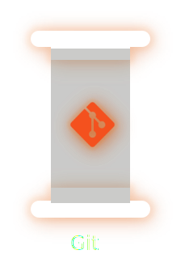
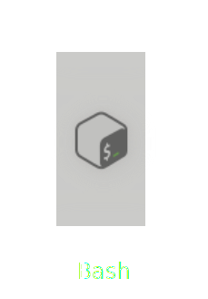
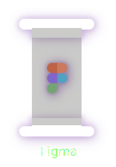
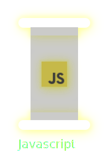
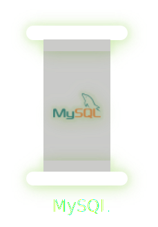
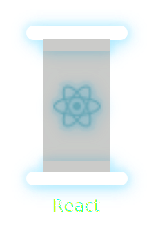

<h3 align="center">
  Bienvenido, soy Ale Merida!
  
</h3>

---

  
# 💫About Me :
🔭 Actualmente trabajando en mi sitio web personal: alemerida.dev

🌱 Aprendiendo y mejorando con Node.js
💻 Enfocado en desarrollo web elegante, eficiente y escalable
⚒️ Dominando el stack: HTML, CSS, JavaScript, Tailwind, React, Node.js, MySQL
🎨 También me gusta diseñar en Figma

👀 Buscando oportunidades para crecer, colaborar y mostrar lo que sé
📁 Compartiendo proyectos reales, con código limpio y bien estructurado
📢 GitHub es mi forma de mostrar lo que sé hacer, sin filtros

📬 Contacto:
✉️ alemerida_dev@gmail.com

# 💻Tecnologias  

# 📊GitHub Stats :
 
 

## 🏆GitHub Trophies

### 📕 Mis ultimos proyectos

<!-- BLOG-POST-LIST:START -->
 [El punto del sabor](https://restaurantexample-alejandrodev.netlify.app/)
  
 [TuProfeVirtual](https://tuprofevirtual.com)
<!-- BLOG-POST-LIST:END -->

➡️ [Mas proyectos...](https://alemerida.dev)

### ✍️Y recuerda...

  

